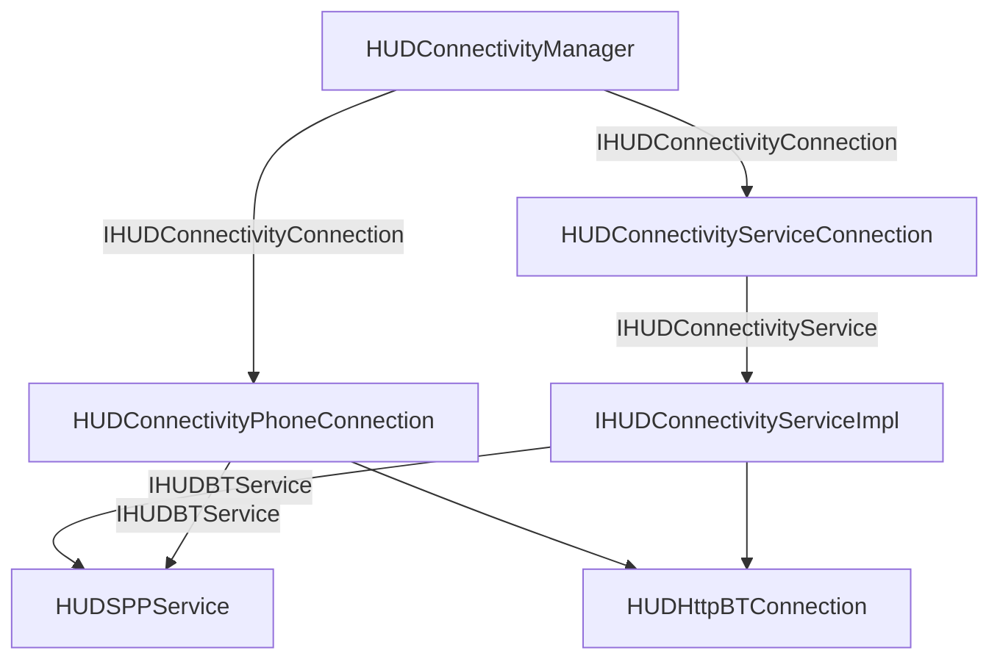

# recon_sdk
To work in the rebuild of former recon sdk.  
STILL NOT FINISH TAKE IT AS DRAFT  

Recon sdk is not working properly in factory reset Goggles, cause this recon sdk is used mainly to communicate the Goggles to the Internet using Bluetooth and the Phone.

In this way developped apps can access the Internet.

This has to be rewritten from scratch.

HUDConnectivityManager: main class fot communications. Holds queues for sending commands.

